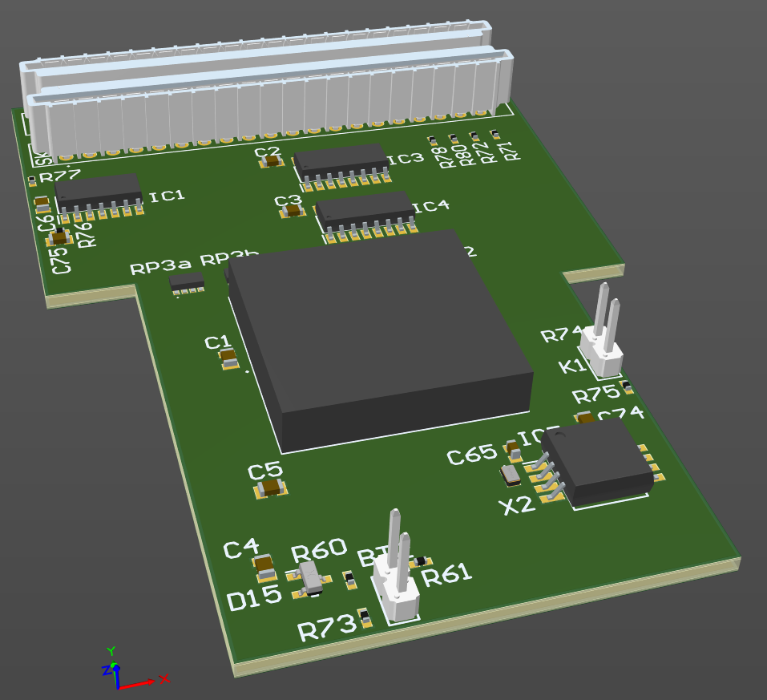

# A3010 Adelaide Keyboard

October 2024

Acorn A3010 Adelaide-variant machines (AGB15-1010xxxx) regularly suffer from the keyboard controller and sockets area of the board being heavily damaged when the onboard battery inevitably leaks.  It can be a huge amount of work, and a lot of messy and tricky patching to the PCB to rectify this damage.    This project is a small PCB designed to fit as simply as possible in place of the onboard keyboard controller and provide new sockets for the keyboard membrane.  As a bonus, this also includes optional CMOS RAM functionality as the CMOS RAM chip and support components are in the same area of the board and also often damaged.  It's recommended, though not required, that most of the original components on the board be removed to use this board.  Points for soldering to the motherboard have been kept to a minimum.

(I also plan to add Simon Inns' SmallyMouse USB mouse controller on the board to provide enhaced mouse functionality and avoid having to patch all the connections to the mouse port).

Note that the machine should be first repaired to sufficient level that it scan power up and POST successfully (bar, perhaps, the CMOS RAM 'SRAM' section of POST) -- particularly of note is the reset circuit which somewhat surprisingly uses IC8, which is really part of the keyboard circuitry -- IC8 should remain on the main board.   (The design may eventually be updated to allow two further patch wires to replicate/replace the onboard circuitry).

It's recommended that the two motherboard keyboard connectors be removed before fitting this - achieved trivially by just bending them back and forth a few times.  At least SK3 should be removed, otherwise pins in this mod board could theoretically just be pushed in to SK3 but for the most reliable connection, removal of SK3 and soldering of this board is recommended.

This board can use a new Atmel 8051 part for the keyboard controller IC, but hot-air removal of the original 8051 (IC2) is usually effective and straightforward - this reduces the cost and avoids having to program the new part.   Reusing other parts from the original board is not recommended as they may have suffered damage from the leaky battery.

This is a work in progress design and is not yet complete.
This has NOT been built or tested yet.

## Licence

No warranty is provided, and this work is used at your own risk.  

Licenced as CC BY-SA 4.0

Copyright 2024 Ian Jeffray

